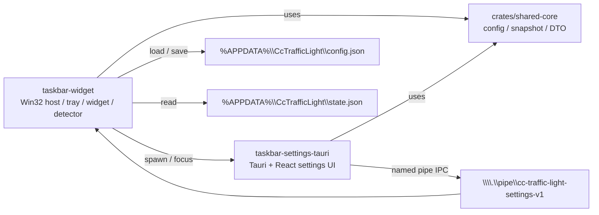

# CC Traffic Light

一个面向 Windows 的任务栏状态指示器与设置工作区，用于聚合 `Codex` / `Claude Code` 运行状态，并通过原生宿主与 `Tauri` 设置界面展示。

## 项目简介

`CC Traffic Light` 当前是一个混合 Rust + PNPM workspace，主链路由三部分组成：

- `taskbar-widget`：Win32 宿主，负责 tray、taskbar widget、detector 轮询、settings 进程管理与 named pipe IPC server。
- `crates/shared-core`：共享业务层，负责配置模型、状态快照、DTO 与 settings service 边界。
- `taskbar-settings-tauri`：`Tauri + React` 设置界面，当前默认 settings 主入口。

当前边界：

- 默认 settings 主入口已经切到 `Tauri`。
- `Win32 settings_window` 仍作为当前 fallback 路径保留。
- 旧 `Slint settings` 已归档到 `archive/slint-settings/`，不属于当前主链路。

## 项目架构



### 运行时事实源

| 项目 | 路径 / 标识 | 用途 |
| --- | --- | --- |
| 正式配置事实源 | `%APPDATA%\CcTrafficLight\config.json` | 保存 settings 正式配置 |
| 运行时状态事实源 | `%APPDATA%\CcTrafficLight\state.json` | 保存 agent 状态聚合结果 |
| 本地 IPC 通道 | `\\.\pipe\cc-traffic-light-settings-v1` | 宿主与 Tauri settings 的本地通信 |

## 快速开始

当前工作区按 Windows 环境设计。

安装前端依赖：

```powershell
pnpm install
```

一键重打包当前构建物：

```powershell
pnpm build
```

仅构建前端设置页：

```powershell
pnpm run build:frontend
```

检查与测试：

```powershell
cargo check -p taskbar-widget --offline
cargo test --workspace --offline
```

正式构建顺序：

```powershell
cargo build -p taskbar-settings-tauri --offline
cargo build -p taskbar-widget --offline
```

重要约束：

- 不要用 `cargo build --workspace --offline` 作为宿主验收构建。
- 宿主验收时保持 `taskbar-settings-tauri` 先、`taskbar-widget` 后。

## 状态说明

当前产品层只保留 5 个主状态：`空闲 / 工作中 / 需要关注 / 已完成 / 错误`。  
`未发现`、`阻塞`、`不可信`、`降级`、`来源冲突` 等工程语义不再作为用户可见主状态。

| 主状态 | 对应的 Codex Hook | 对应的 Claude Code Hook |
| --- | --- | --- |
| 空闲 | 无活跃任务时的默认回落；没有明确 `working / needs_attention / completed / error` 证据时回到空闲 | 同 Codex |
| 工作中 | `UserPromptSubmit`、`PreToolUse`、`PostToolUse`、`PreCompact`、`PostCompact`、`SubagentStart` | `UserPromptSubmit`、`PreToolUse`、`PostToolUse`、`PreCompact`、`PostCompact`、`SubagentStart` |
| 需要关注 | `PermissionRequest` | `PermissionRequest` |
| 已完成 | `Stop`、`SubagentStop`；仅在明确完成事件下进入，并在短窗口后回到空闲 | `Stop`、`SubagentStop`；仅在明确完成事件下进入，并在短窗口后回到空闲 |
| 错误 | `StopFailure`、`PostToolUseFailure`、`ToolUseFailure`，以及带明确失败语义的 `Stop` | `StopFailure`、`PostToolUseFailure`、`ToolUseFailure`，以及带明确失败语义的 `Stop` |

补充约束：

- `Notification` 当前不直接映射为 `需要关注`，避免把普通通知误报成等待用户操作。
- 当底层信号不足以证明 `需要关注 / 已完成 / 错误` 时，产品层优先保守回 `空闲`。
- overall 主状态优先级为：`错误 > 需要关注 > 工作中 > 已完成 > 空闲`。

## 文档导航

- [Tauri Settings Architecture Baseline](docs/plan/tauri-settings-architecture-baseline.md)
- [Tauri Settings IPC Contract](docs/plan/tauri-settings-ipc-contract.md)
- [Taskbar Widget Visual Roadmap](docs/plan/taskbar-widget-visual-roadmap.md)
- [Tauri Settings Migration Checklist](docs/checklist/tauri-settings-migration.md)
- [Latest Handoff](docs/handoff/2026-07-04-1429.md)
- [Taskbar Widget README](taskbar-widget/README.md)
