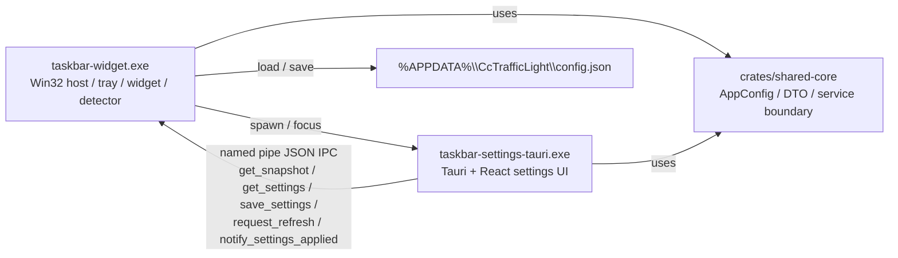

# Tauri Settings Migration Architecture Baseline

日期：2026-07-03

## 1. 迁移边界

本次迁移固定为三段式边界：

- `taskbar-widget` 保留 Win32 host、tray、widget、message loop、detector 轮询、taskbar attach/retry。
- 新的 `Tauri settings` 只接管 settings presentation、settings window lifecycle 和前端交互。
- `shared-core` 承接配置模型、状态投影、settings service 和跨 UI 的 DTO。

明确不动的模块：

- `taskbar-widget/src/taskbar.rs`
- `taskbar-widget/src/tray_icon.rs` 的宿主职责
- `taskbar-widget/src/main.rs` 中 widget / tray / detector 主链路

明确需要迁移或抽边界的模块：

- `archive/slint-settings/taskbar-widget-settings_slint.rs`（已归档）
- `taskbar-widget/src/settings_window.rs`
- `taskbar-widget/src/app_config.rs`
- `taskbar-widget/src/ui_state.rs`
- `taskbar-widget/src/runtime_contract.rs`

当前已经落地的架构结论：

- 默认 `Open Settings` 主入口已经切到 `Tauri`
- `Slint settings` 已从宿主主链路退场并归档到 `archive/slint-settings/`
- 仅保留 `settings_window.rs` 作为极限 Win32 fallback
- widget / tray / detector / taskbar attach 仍然由 `taskbar-widget` 原地承担，不属于本轮 Tauri UI 迁移范围

## 2. 进程边界与通信方向



通信方向固定为：

- `taskbar-widget.exe` 负责管理 settings 子进程生命周期
- `taskbar-settings-tauri.exe` 不直接碰宿主内部状态，只经由 named pipe + shared-core DTO 读写
- 配置文件仍然是持久化事实源，IPC 不是第二事实源

## 3. 当前 Settings 打开链路

当前 `Open Settings` 实际链路如下：

1. tray 菜单或 tray callback 触发 `TrayAction::OpenSettings`
2. `main.rs::handle_tray_action()` 先尝试 `settings_process::open_or_focus_tauri_settings()`
3. 若 Tauri settings 进程可启动或已存在，则直接复用/聚焦该窗口
4. 若显式设置 `CC_TRAFFIC_LIGHT_SETTINGS_HOST=win32` / `fallback`，或 Tauri 启动失败，则显示 `settings_window.rs` 创建的 Win32 fallback 窗口

当前结论：

- 默认入口已经切到 `Tauri settings`，宿主不再初始化或同步 `Slint settings`。
- `settings_window.rs` 仍然承担 fallback UI、配置写回 helper、手动刷新命令入口和当前 settings backend 角色。
- `CC_TRAFFIC_LIGHT_SETTINGS_HOST=win32` 或 `fallback` 可作为显式 fallback 开关保留。
- 这意味着 Tauri 迁移已经越过“灰度只读 UI”阶段，后续重点转向运行验证、fallback hardening 和 Win32 fallback 是否长期保留。

## 4. 当前 Settings 职责盘点

### 4.1 配置 schema

事实来源：`taskbar-widget/src/app_config.rs`

当前正式配置字段：

- `localization.language`
- `general.autostart_enabled`
- `general.start_minimized_to_tray`
- `general.close_to_tray`
- `monitoring.codex_enabled`
- `monitoring.claude_enabled`
- `appearance.ui_theme`
- `appearance.indicator_style`
- `appearance.widget_size`
- `appearance.show_labels`
- `appearance.reduced_motion`
- `diagnostics.last_opened_page`
- `diagnostics.last_manual_refresh_at`

### 4.2 状态快照

事实来源：`taskbar-widget/src/ui_state.rs`

当前统一状态快照字段：

- `widget_mount_state`
- `overall_state`
- `last_widget_attach_at`
- `last_detection_refresh_at`
- `last_error_summary`
- `sources["codex" | "claude"]`

每个来源包含：

- `source_id`
- `state`
- `confidence`
- `method`
- `updated_at`
- `message`

### 4.3 设置命令

当前真实写入命令集中在 `taskbar-widget/src/settings_bridge.rs`：

- `update_config`
- `toggle_autostart_setting`
- `apply_full_settings`
- `request_manual_refresh_command`

当前含义：

- 持久化事实源仍然是 `%APPDATA%\\CcTrafficLight\\config.json`
- autostart 的真实副作用仍由 `autostart.rs` 执行
- 手动刷新通过向主窗口发送 `WM_COMMAND` 的 `TRAY_CMD_REFRESH` 实现

### 4.4 窗口入口

- `taskbar-settings-tauri`：当前默认 settings presentation host
- `settings_window.rs`：当前 fallback window + backend helper
- `main.rs`：settings 生命周期总入口和 host 选择逻辑

### 4.5 字符串 / i18n

- `taskbar-settings-tauri/src/App.tsx` 当前直接维护页面文案与标签
- `settings_window.rs` 仍有大量硬编码英文
- tray 已开始依赖 `Localizer`

结论：

- Tauri 迁移后，文案源头应以共享 i18n / label 映射层为准，不能复制 `settings_window.rs` 的硬编码文本。

### 4.6 UI 渲染

- `taskbar-settings-tauri` React + Tauri：当前正式 settings presentation
- `settings_window.rs`：仅作为 fallback presentation

## 5. 当前 6 个页面的真实字段与交互要求

### Overview

真实展示字段：

- overall state
- widget mount state
- last detection refresh
- last widget attach
- codex source state/detail
- claude source state/detail

行为要求：

- 读取真实 `AppStatusSnapshot`
- 需要周期刷新

### General

真实可写字段：

- `general.autostart_enabled`
- `general.start_minimized_to_tray`
- `general.close_to_tray`
- `localization.language`

行为要求：

- 修改后立刻写回配置
- autostart 还要立刻触发注册表副作用

### Monitoring

真实可写字段：

- `monitoring.codex_enabled`
- `monitoring.claude_enabled`

行为要求：

- 修改后立刻写回配置
- 后续宿主应基于共享 service 即时感知启停状态

### Appearance

真实可写字段：

- `appearance.ui_theme`
- `appearance.indicator_style`
- `appearance.widget_size`
- `appearance.show_labels`
- `appearance.reduced_motion`

行为要求：

- 修改后立刻写回配置
- 影响本地显示层

### Diagnostics

真实字段：

- `last_detection_refresh_at`
- `last_error_summary`
- source method / confidence / updated_at / message
- `diagnostics.last_manual_refresh_at`

真实动作：

- `request_manual_refresh_command`

行为要求：

- 页面本身读真实状态
- 刷新动作需要即时通知宿主

### About

真实字段：

- product name
- package version
- runtime description
- config path
- current language mode

## 6. Shared Core 第一批边界

第一批进入 `shared-core` 的内容：

- `AppConfig` 及其子配置
- `AppStatusSnapshot` 的只读投影 DTO
- settings read/write service
- settings mutation result / error 类型
- status snapshot read model
- settings page / enum DTO

明确暂不进入 `shared-core` 的内容：

- Win32 `HWND`
- `PostMessageW`
- tray 菜单句柄与消息 ID
- Slint/Tauri runtime 类型
- autostart 的 Windows 注册表实现细节

保守边界建议：

- `shared-core` 只定义纯 Rust 业务模型和 service trait / facade
- `taskbar-widget` 保留 platform adapter，负责把 shared-core 命令落到 Win32、registry、message loop

## 7. UI Fidelity 基线

本次 Tauri UI 的视觉基线以以下文件为准：

- `docs/ui/cc_traffic_light_nothing_demo_strict.html`
- `docs/ui/nothing-signal-console-spec.md`
- `docs/ui/nothing-signal-console-checklist.md`

固定约束：

- 保留 6 页结构
- 维持 Nothing Signal Console 的层级、编号导航和信息密度
- 允许工程实现层面对 HTML demo 做近似，不追求像素级复刻
- 若视觉还原与即时生效/稳定性冲突，以稳定性优先

## 8. Workspace 与构建约束

当前仓库事实：

- 根目录已经是 Cargo workspace
- workspace 成员为：
  - `crates/shared-core`
  - `taskbar-settings-tauri/src-tauri`
  - `taskbar-widget`

当前必须写清楚的构建约束：

- `cargo build --workspace` 不能再作为宿主验收产物来源
- 原因不是一般性编译失败，而是 workspace 级 feature unify 会把 Tauri 侧 `muda/common-controls-v6` 污染进宿主最终链接产物
- 污染后的 `target/debug/taskbar-widget.exe` 会重新静态导入 `comctl32!TaskDialogIndirect`，导致 loader 阶段报错
- 宿主验收必须使用单包构建后的产物

当前推荐命令：

```powershell
cargo check -p taskbar-widget --offline
cargo test --workspace --offline
pnpm build
cargo build -p taskbar-settings-tauri --offline
cargo build -p taskbar-widget --offline
```

说明：

- `taskbar-settings-tauri` 先构建，`taskbar-widget` 最后单独构建
- lifecycle 脚本已经按这个顺序修正

## 9. 验证命令基线

当前最小验证命令集合：

- `cargo check -p taskbar-widget --offline`
- `cargo test --workspace --offline`
- `pnpm build`
- `cargo build -p taskbar-settings-tauri --offline`
- `cargo build -p taskbar-widget --offline`

验证约束：

- 如果目标是验证宿主 loader / tray / settings lifecycle，不要改用 `cargo build --workspace`
- 如果只是跑 shared-core / Tauri Rust 编译，可以保留 workspace 级 `cargo test`

## 10. 回退与归档策略

回退策略固定如下：

- 默认走 Tauri path；`CC_TRAFFIC_LIGHT_SETTINGS_HOST=win32` 或 `fallback` 作为显式 fallback 开关保留
- `settings_window.rs` 当前仍保留为极限 fallback backend / archive 候选
- 旧 Slint settings 已迁移到 `archive/slint-settings/`，不再保留主链路引用

## 11. 当前已验证状态

当前已被脚本和日志直接验证的事实：

- tray `Open Settings` 默认进入 Tauri 路径
- 重复打开会复用同一 settings 进程
- 关闭 settings 后可再次拉起
- 强杀 settings 后宿主允许再次打开
- 宿主正常退出时会回收其管理的 settings 子进程

当前仍未完成的部分：

- 全量可写项的逐项“UI 变化 / 配置落盘 / 宿主行为变化”验收
- `pnpm build`、视觉差异文档、主链路无回归的补证

## 12. 下一步建议

基于当前事实，下一批最小可验证动作应为：

1. 补 `pnpm build` 与主链路回归证据
2. 逐项验收 General / Monitoring / Appearance / Diagnostics 的真实写路径
3. 记录 Tauri UI 与 HTML demo 的剩余差异
4. 评估 `settings_window.rs` 是否继续保留为长期 fallback

## 13. 当前构建产物形态确认

当前仓库中的 settings 迁移产物形态固定为：

- 原生宿主仍是 `taskbar-widget.exe`
- settings UI 是独立的 `taskbar-settings-tauri.exe`
- 两者通过本地 IPC 协议通信，配置文件仍是持久化事实源

当前接受的分发形态：

- 用户视角上仍是一套应用，但安装目录下允许出现多个可执行文件和对应 WebView/Tauri 运行时文件
- `taskbar-widget` 负责按需拉起 `taskbar-settings-tauri`，而不是把 settings 嵌回宿主窗口

当前实现信号：

- `taskbar-settings-tauri/src-tauri/tauri.conf.json` 的 `bundle.active` 仍为 `false`，说明当前阶段先以开发/本地构建产物为准，不提前承诺安装包格式
- 这不影响本阶段对“多文件安装可接受，但用户认知仍是一套应用”的约束判断

边界结论：

- `TSM-D-05` 以“独立 settings 进程 + 多文件分发可接受 + 宿主管理打开方式”作为当前确认结果
- 真正的安装器、签名、最终 bundle 策略留到后续 packaging 阶段再验证，不与当前 scaffold 阶段混做
